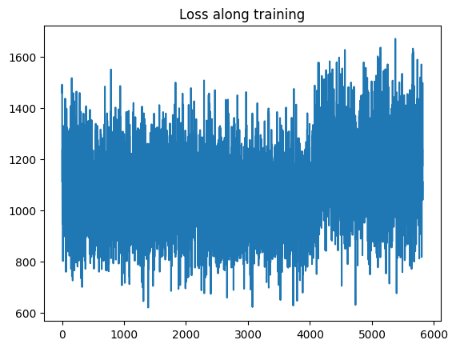

# OpenLanePifPaf

[Video presentation](https://youtu.be/PmMTP3SOauc)<br />
3D-Lane Detection, Group 17, Oliver Colombini-Ljungberg 309996, Rémi Oddon 31296<br />
EPFL, CIVIL-459, Deep Learning for Autonomous Vehicles

# Original publications 

&nbsp;&nbsp;&nbsp;&nbsp;This github page is a fork of [OpenPifPaf](https://github.com/openpifpaf/openpifpaf), and is based on their publications.<br />

>[New 2021 paper](https://arxiv.org/abs/2103.02440).<br />
>Previous [CVPR 2019 paper](http://openaccess.thecvf.com/content_CVPR_2019/html/Kreiss_PifPaf_Composite_Fields_for_Human_Pose_Estimation_CVPR_2019_paper.html).
>
> __OpenPifPaf: Composite Fields for Semantic Keypoint Detection and Spatio-Temporal Association__<br />
> _[Sven Kreiss](https://www.svenkreiss.com), [Lorenzo Bertoni](https://scholar.google.com/citations?user=f-4YHeMAAAAJ&hl=en), [Alexandre Alahi](https://scholar.google.com/citations?user=UIhXQ64AAAAJ&hl=en)_, 2021.
>
>[Guide on how to use openpifpaf](https://openpifpaf.github.io/intro.html)<br />


&nbsp;&nbsp;&nbsp;&nbsp;We also use the network and weights of [DIFFNet](https://github.com/brandleyzhou/DIFFNet) as a depth predictor.<br />

>[2021 Paper](https://arxiv.org/pdf/2110.09482.pdf)
>
> __Self-Supervised Monocular Depth Estimation with Internal Feature Fusion__<br />
> _Hang Zhou, David Greenwood, Sarah Taylor_, 2021.


# Contribution overview

&nbsp;&nbsp;&nbsp;&nbsp;The goal of __OpenPifPaf__ is to detect, associate and track a set of semantic keypoints, originally forming an human body pose, on an image or a video. These keypoints are therefore predicted in a 2D-plane, corresponding to the 'u' and 'v' dimensions of an image. <br />


&nbsp;&nbsp;&nbsp;&nbsp;On the other hand, the goal of __OpenLanePifPaf__ is to detect and associate a lane on a road in all 3 dimensions of the real world, based on an image or video.<br />
&nbsp;&nbsp;&nbsp;&nbsp;For this purpose, we thus had to change the dataset on which we wanted to train our network so that it learned how to predict lanes. Since the idea of 'joints' don't make as much sence on a lane (which more or less lookes like a straight line), we decided that in order to make it as simple as possible in our training we would only use two joints (at the start and end of our lane).<br /> 
&nbsp;&nbsp;&nbsp;&nbsp;Additionally, and most importantly, we needed to add a dimension to our prediction for each keypoint. One of the biggest modifications we had to make inside the existing code was to change the way the encoder that converts ground truth annotations to fields works. The decoder, loss functions, dataset, etc were also folders and files that needed adaptation to handle 3D keypoints. For example, the original working principle of the composite intensity and association fields is to predict an offset to the closest joint of a certain type or between two for associations. This idea of an offset doesn't work anymore once we try to apply it in 3D. Here, we had to put the absolute value in 3D and no longer an offset in the image plane for each pixel in the composite field because we need the preduction and the ground truth to be in the same space.<br />
&nbsp;&nbsp;&nbsp;&nbsp;Finally, in order to foster the learning inside our network, we also added the possibility to have an additional parameter as an input, which is the estimated depth at each pixel of our image. This input is computed thanks to the neural network __DIFFNet__ that has been trained beforehand on the benchmark dataset __Kitty__, and from which we recovered the trained weights. We think that adding this forth channel aver the image contributes to have better features for the encoder network to better learn how to predict depth in images.


# Experimental setup

&nbsp;&nbsp;&nbsp;&nbsp;To see if our network was able to predict anything valuable, we tried to make our model overfit on a single image at several stages in the building of the full network.<br />
&nbsp;&nbsp;&nbsp;&nbsp;Our first overfit was made using the original code from __Openpifpaf__, after adapting our dataset to make it compatible with COCO. Thus, the goal was to try to detect a lane in 2D to see if the conversion of our dataset works correctly.<br />
&nbsp;&nbsp;&nbsp;&nbsp;We then tried several overfits once the code had been adapted to predict 3D keypoints. Since we changed the number of joints inside our lane-skeleton several times, we tried to make an overfit each time to evaluate how it affected the loss descent, and to try to optimize hyperparameters such as the learning-rate, the warmup factor etc.<br />
&nbsp;&nbsp;&nbsp;&nbsp;We use the same evaluation metric as COCO, which are the Average Precision (AP) and the Average Recall (AR) metrics. Both AP and AR are computed for different Intersection over Union (IoU) thresholds.


# Environment setup
&nbsp;&nbsp;&nbsp;&nbsp;To set up the environment, you have to clone this repository and create a virtual environment with Python 3.7.7. Then, you may run the following commands to install the required packages of OpenLanePifPaf and install manually pycocotools package that we modified.
```sh
pip3 install --editable 'OpenLanePifpaf/[dev,train,test]'
pip3 uninstall -y pycocotools
pip3 install --editable OpenLanePifpaf/pycocotools-2.0.4/
```
Note that you may have depending on your machine to uninstall urllib3 and reinstall it with the version 1.26.15. Then clone [DIFFNet](https://github.com/brandleyzhou/DIFFNet.git) in __OpenLanePifPaf/src/openpifpaf/network__ and move __depth_net.py__ directly inside it.


# Dataset

The dataset used for the training and validation comes from [Openlane](https://github.com/OpenDriveLab/OpenLane/tree/main). It is labeled with the following format : <br />

- Lane shape. Each 2D/3D lane is presented as a set of 2D/3D points. It contains three different attributes : 
  - The __'uv'__ attribute, which corresponds to the 2D position in pixels of a joint.
  - The __'kps'__ attribute, which corresponds to the 3D position in meters of a joint.
  - The __'vis'__ attribute, which corresponds to the visibility of a joint (as a boolean).
- Lane category. Each lane has a category such as double yellow line or curb.
- Lane property. Some of lanes have a property such as right, left.
- Lane tracking ID. Each lane except curb has a unique id.
- Stopline and curb.

The Openlane dataset folder is using the following hierarchy : <br /> 

- An __images/__ folder containing all segments (1000 in total). It is divided into two sub-folders for the __training/__ and __validation/__ respectively. 798 segments are used for the training and 202 for the validation. Each segment contains a large number of images (around 200) downsampled from a video.

- Two annotation folders, respectively called __lane3d_1000/__ and __lane3d_300/__. The former one contains the 2D/3D lane annotations for all 1000 segments, with a _.json_ file for each image. The latter one is a subset of __lane3d_1000/__ with the same structure, but containing only 240 segments for the training and 60 segments for the validation. <br />

&nbsp;&nbsp;&nbsp;&nbsp;To acquire the Openlane dataset, you may follow the procedure described [here](https://opendatalab.org.cn/OpenLane/cli). Once this is done, we can convert the Openlane dataset to the COCO format required by OpenPifpaf and OpenLanePifpaf by creating a directory in which the dataset will be loaded:<br />

```sh
mkdir data-openlane
```


&nbsp;&nbsp;&nbsp;&nbsp;Then the conversion to COCO format is performed by the file __openlane_to_coco.py__ which opens all the Openlane video segments and samples 15% of the images because of redundancy from one image to an other in the original segment and also to reduce the computational time at training phase. Then __openlane_to_coco.py__ adapts the original annotations for each image and lane by taking only two 3D keypoints and two 2D keypoints in the image plane and their visibility. Moreover metadatas are also stored with the keypoints in a json file located in the directory __data-openlane/annotations/__. The conversion may be initiated with the following command line:


```sh
python3 -m openpifpaf.plugins.openlane.openlane_to_coco --dir_data=/work/scitas-share/datasets/Vita/civil-459/OpenLane/raw --dir_out=/home/[username]/data-openlane
```

# Instructions to run and test model

&nbsp;&nbsp;&nbsp;&nbsp;To train the model, the file __train.py__ is used. You can change the hyperparameters depending on what is needed (see [this page](https://openpifpaf.github.io/cli_help.html) for more):
```sh
python3 -m openpifpaf.train --lr=0.001 --momentum=0.95 --b-scale=10.0 --clip-grad-value=10 --epochs=50 --batch-size=16 --weight-decay=1e-5 --dataset=openlane --basenet=shufflenetv2k16
```

&nbsp;&nbsp;&nbsp;&nbsp;For systems with high power computing supporting [Slurm](https://slurm.schedmd.com/quickstart.html), training can also be launched with the bash file __train.sh__. The hyperparameters will be changed directly inside that file :

```sh
sbatch OpenLanePifpaf/train.sh
```

&nbsp;&nbsp;&nbsp;&nbsp;To perform evaluation of the model, the file __eval.py__ is used with the following command:

```sh
python3 -m openpifpaf.eval --dataset=openlane --checkpoint=checkpoint_file
```

&nbsp;&nbsp;&nbsp;&nbsp;To perform inference, we may use the __predict.py__ file to infere the output on an image or a set of images you may use the following command line precising which images to use with their path and which model checkpoint to use.
```sh
python3 -m openpifpaf.predict --dataset=openlane --json --checkpoint=checkpoint_file
```

# Results
&nbsp;&nbsp;&nbsp;&nbsp;Our loss plot along training shows that the network struggles at the training phase to learn anything meaningful. The loss along the training shows no improvement as seen in the following figure. <br />



&nbsp;&nbsp;&nbsp;&nbsp;Using the metric of Coco of AP (Average Precision) and AR (Average Recall) on our predictions we obtain the following table :
| AP | AP0.5 | AP0.75 | APM | APL | AR | AR0.5 | AR0.75 | ARM | ARL |
| -- | ----------- | -- | ----------- | -- | ----------- | -- | ----------- | -- | ----------- |
| 0.067 | 0.132 | 0.067 | 0 | 0.142 | 0.106 | 0.168 | 0.112 | 0 | 0.139

&nbsp;&nbsp;&nbsp;&nbsp;As we can see, these evaluation metrics show very poor results. This comes from the fact that our network has an apparent problem when training. Indeed, we have a loss that never decreases (see graph above), and we believe that it can in part be caused by the different thresholds on visibility, confidence etc... inside our files, and under which our predictions are ignored. We believe these thresholds don't really have the same meaning in a 3D world and should be changed or even ignored. However, it couldn't be done during this project since changing these parameters would have taken a huge amount of time, since it requested to recreate the whole environment at each modification to see a difference (this is due to the fact these thresholds are inside of C++ files which are compiled only when the packages of the environment are installed).

# Conclusion

&nbsp;&nbsp;&nbsp;&nbsp;In addition to creating a new folder with four new files to be able to convert our dataset to a format compatible with COCO, as well as adding a folder with the __DIFFNet__ network, we also had to make over 200 modifications in over 30 separate files of the existing __OpenPifPaf__ code to make it possible to predict the keypoints in 3D instead of in 2D. We also identified a small error in the original code.<br /> 

&nbsp;&nbsp;&nbsp;&nbsp;For future work, a better understanding and thourough debuging of the training phase is needed. In addition, we should pay attention to files in the decoder that might ignore our predictions due to the thresholding effect mentioned above

&nbsp;&nbsp;&nbsp;&nbsp;This project as a whole was very enriching and complete, with a very vast set of factors to take into account for the good procedings of it all.